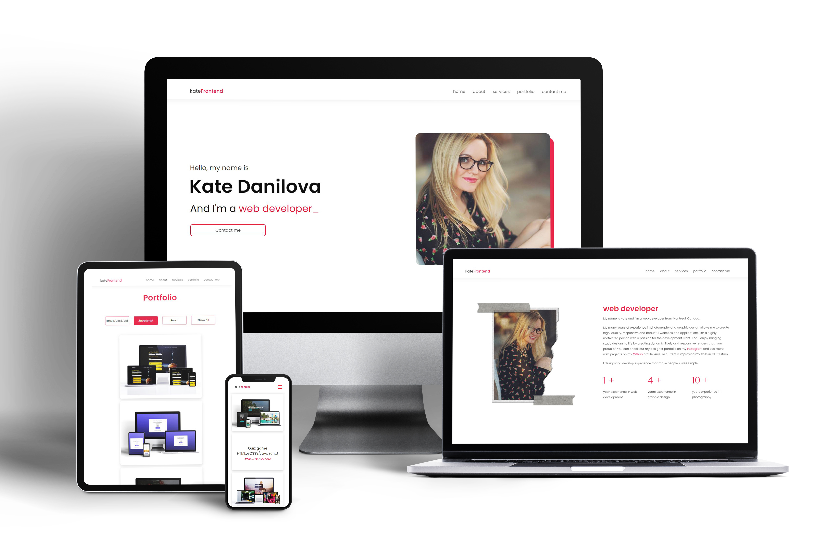

# Personal portfolio 

## 🦉 Main information

My name is Kate and I'm a web developer from Montreal, Canada.

My many years of experience in photography and graphic design allows me to create high-quality, responsive and beautiful websites and applications.\
I'm a highly motivated person with a passion for the development Front-End. I enjoy bringing static designs to life by creating dynamic, lively and responsive renders that I am proud of.\
You can check out my designer portfolio on my Instagram and see more web projects on my Github profile.\
And I'm currently improving my skills in MERN stack.

I design and develop experience that make people's lives simple.

## 🦊 My technical skills: 

### Front-End Development:
- Html5 | CSS3 | Sass | Styled Components | Tailwind | Bootstrap5 | JavaScript | React | Redux | REST API |  GSAP 

### Backend Development:
- Node.js | Express.js | MongoDB | Firebase | Insomnia | Postman

### Web & Graphic Design: 
- Adobe Photoshop | Adobe Illustrator | Adobe InDesign | Adobe Lightroom | Figma

## ⚡ Built With
[HTML5](https://www.w3schools.com/html/) / [CSS3](https://www.w3schools.com/css/) / [JavaScript](https://www.w3schools.com/js/)